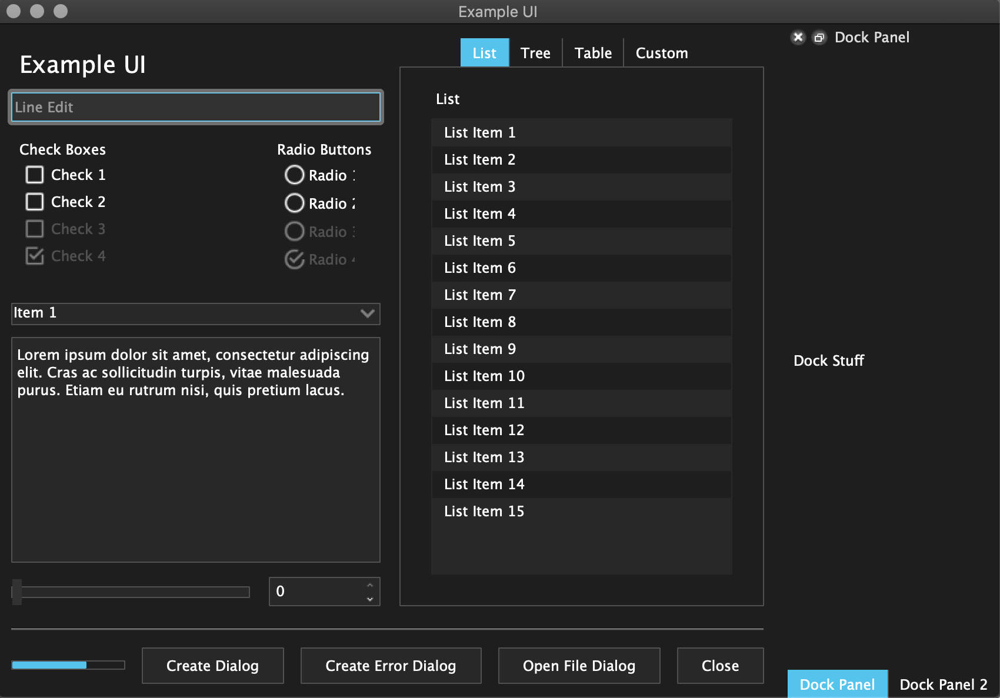

# Nori: *Unified UI System* #

## Introduction ##
**Nori** is designed to provide a single, unified UI into production with no
additional effort from developers. The provided **Nori** class can be easily
sub-classed or instantiated separately and used like a wrapper around any
UI that is derived from a `QWidget`. **Nori** will apply styling, menus,
icons and some basic key press functionality automatically and can be
expanded easily through internal methods. **Nori** is derived from a standard
`QMainWindow` and does not override any default functionality so it is as
extensible as the original.

**Nori** can even be used to generate second windows, modal dialogs, popups,
etc. This allows for a single class to act as any kind of window.

**Nori** only has a few dependencies so it can be incorporated with very little
overhead.

### Requirements ###
-   PyQt5 / PySide2
-   Python 2 / 3

### Example ###
If you want to play with an example UI utilizing **Nori**, you can run the following:
```bash
python example.py -e
```



This is a large collection of default widgets and can be very useful for testing styling or getting reference.

<span style="color: grey;">:information_source: You can also launch the example widget without the **Nori** modifications using the following:</span>
```bash
python example.py -e -d
```
The full list of arguments is below:
-   `-i`, `--icon`: Define an icon
-   `-t`, `--title`: Set a title
-   `-y`, `--styles`: Set a stylesheet
-   `-l`, `--palette`: Set a palette
-   `-s`, `--show_status_bar`: Show the status bar
-   `-p`, `--as_popup`: Show as popup
-   `-c`, `--center`: Move the window to the center of the screen

---

These arguments override all previous ones in order to use the example:
-   `-e`, `--example`: Display the example instead
-   `-d`, `--default`: Display the example with a default QMainWindow
-   `-f`, `--from_file`: Display a central widget loaded from a file

## Usage ##
There are two ways of using the **Nori** class:

### Instantiation ###

#### Sub-classing ####
This works just like sub-classing anything from PyQt/PySide:
```python
import nori

class YourCustomUI(nori.Nori):
    """Subclass the Nori like normal."""
    def __init__(self):
        super(YourCustomUI, self).__init__()

        # Your UI Here
```

#### Separate Instantiation ####
In this case, you create your UI in one class, **Nori** in another and then do
the assignment:
```python
from PyQt5 import QtCore, QtGui, QtWidgets

import nori

class YourCustomUI(QtWidgets.QWidget):
    """Make your UI as normal contained in a QWidget."""

    def __init__(self):
        super(YourCustomUI, self).__init__()

        # Your UI Here


n_window = nori.Nori(central_widget=YourCustomUI())
```

That's all that is needed for basic functionality.

:information_source: For detailed documentation, please see the generated
documentation in `/docs`.

### Styling ###
Styling is composed of two parts:

#### Stylesheet ####
The **stylesheet** is the `CSS`-style definition for the look and feel of the UI.
Stylesheets in **Nori** support variables through the <u>Palette</u> described below.
If nothing is provided, a default stylesheet is used.

<span style="color: grey;">:information_source: 'none' can also be provided to
not apply any styling.</span>

#### Palette ####
The **palette** is used to define colors, default paths, fonts and any other piece
of data for reuse in styling. **Nori** provides a method for applying the
palette to a stylesheet by substituting `@variable` with some other piece of
data. This replaces the missing functionality of variables in `.qss` files.

Palettes are particularly useful in creating a theme for your UI since changing
a few colors in the palette will affect the entire UI.

## Custom Widgets ##
Being able to define custom widgets is a fundamental part of Qt. **Nori** has a
few custom widgets available for use and if you create any the you feel could
have a lot of reuse, please put them into this package for others to use.

### Switches ###
Some custom `Switch` widgets are provided for toggles. They are drag-able,
clickable and can only have a `True` or `False` state.

### Dialogs ###
This package comes with a preset `NDialog` class that makes dialog creation
trivial. It is made in the same manner as an **Nori** because it uses **Nori**
as its base class.

There is also an `NErrorDialog` available (subclassed from `NDialog`) specific
to providing extra functionality for viewing and reporting errors.

## Icons ##
**Nori** contains a library of icons which should be utilized as much as possible
for consistency. If you create new icons for your application, you are
encouraged to put them into this package for reuse.

## Fonts ##
The **Nori** class has the ability to load and utilize custom fonts. Some font
families are provided within the **Nori** package.

## Utils ##
**Nori** contains a large number of utilities that can aid in ui tasks that
don't necessarily depend on an **Nori**.
This allows you to use parts of **Nori**, such as icons, fonts, application
properties etc. without needing to instantiate an **Nori**.

## Config ##
**Nori** has some basic config options stored in a `config.yaml` file.

# ToDo #
-   :o: Check if any application-specific code is necessary
-   :o: Tests
-   :o: Run through SCP\-914 on "Fine" and ensure
<span style="background-color: black; color: white; font-family: mono;
font-weight: bold;">\[REDACTED\]</span> are not present
-   :o: Establish
<span style="color: red;">S</span>
<span style="color: orange;">Y</span>
<span style="color: yellow;">N</span>
<span style="color: green;">E</span>
<span style="color: blue;">R</span>
<span style="color: indigo;">G</span>
<span style="color: violet;">Y</span>
-   :heavy_check_mark: Pet the :rabbit:
